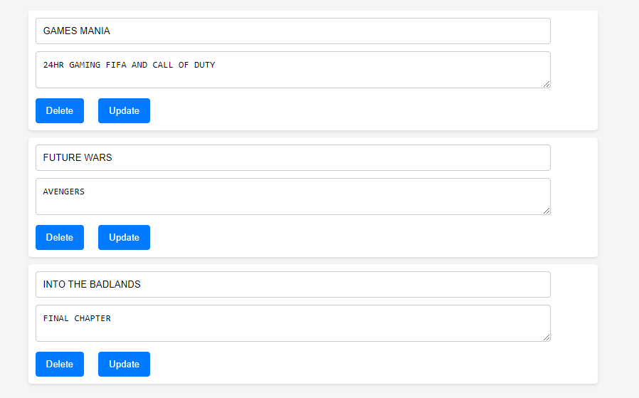
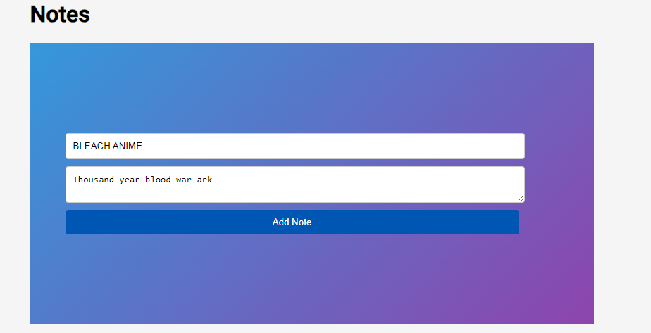
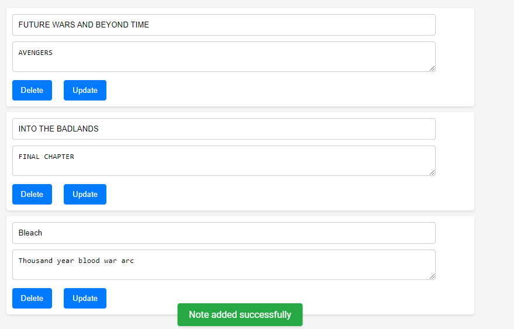
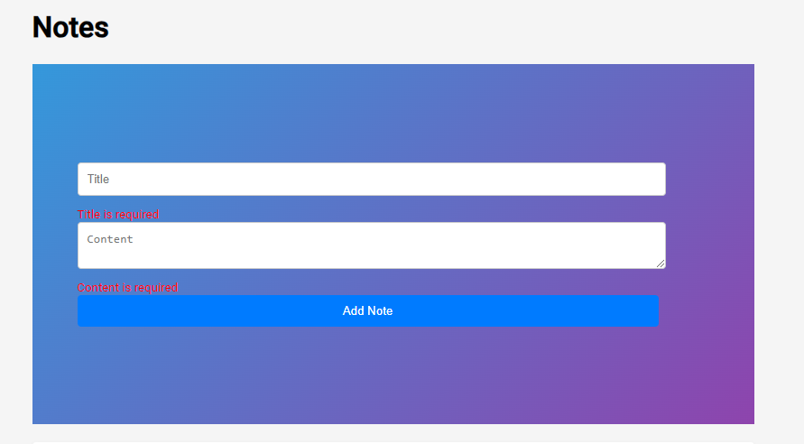

# Notebook

### About Application Notebook

_Application Notebook_ is a powerful tool designed to streamline your data analysis and computational tasks. It combines the power of data processing libraries with an intuitive interface, making it easy for both beginners and experienced developers to work with data.

### Features

- **Interactive Coding**: Write and execute code in an interactive environment.
- **Data Visualization**: Create beautiful and insightful charts and graphs.
- **Collaboration**: Share your notebooks and collaborate with others.
- **Extensibility**: Extend the functionality with a wide range of plugins and extensions.

### Why Application Notebook?

_Application Notebook_ is designed with the user in mind. It's not just about writing code, it's about creating a seamless experience for data analysis, machine learning, and computational tasks. With _Application Notebook_, you can focus on what matters most - deriving insights from your data.

Join us on this exciting journey and let's explore the world of data together with _Application Notebook_!
This project was generated with [Angular CLI](https://github.com/angular/angular-cli) version 18.0.3.

## Development server

Run `ng serve` for a dev server. Navigate to `http://localhost:4200/`. The application will automatically reload if you change any of the source files.

## Code scaffolding

Run `ng generate component component-name` to generate a new component. You can also use `ng generate directive|pipe|service|class|guard|interface|enum|module`.

## Build

Run `ng build` to build the project. The build artifacts will be stored in the `dist/` directory.

## Running unit tests

Run `ng test` to execute the unit tests via [Karma](https://karma-runner.github.io).

## Running end-to-end tests

Run `ng e2e` to execute the end-to-end tests via a platform of your choice. To use this command, you need to first add a package that implements end-to-end testing capabilities.

## Further help

To get more help on the Angular CLI use `ng help` or go check out the [Angular CLI Overview and Command Reference](https://angular.dev/tools/cli) page.

## Operations

<ul class="timeline">
  <li class="timeline-item">2007: Started college</li>
  <li class="timeline-item">2011: Graduated from college</li>
  <li class="timeline-item">2012: Started first job</li>
  <li class="timeline-item">2015: Promoted to senior position</li>
</ul>

1. Get all notes
   
2. Add a note
   
   
3. Update a note
   
4. Delete a note
   
5. Form error handling
   

## RUN THE EXPRESS BACKEND CODE FOR A COMPLETE EXPERIENCE

[*Link to backend code ](https://github.com/Panther-12/teach2give_tasks/tree/main/notebook)